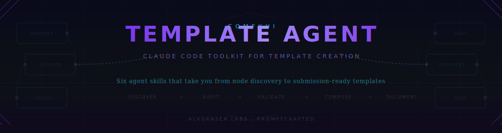

<p align="center">
  
</p>

<p align="center">
  <a href="https://github.com/alvdansen/comfyui-template-agent/actions/workflows/ci.yml"></a>
  
  
  
</p>

<p align="center">
  <strong>Go from "what should we build?" to a submission-ready ComfyUI template in a single conversation.</strong>
</p>

---

**ComfyUI Template Agent** is a Claude Code toolkit that gives you six agent skills for creating ComfyUI templates. It handles node discovery, template gap analysis, workflow validation, composition, and documentation generation -- all through natural language in your terminal.

> You talk to Claude. Claude talks to the ComfyUI ecosystem. You get a tested, validated, submission-ready template.

<br>

<table>
<tr>
<td align="center"><strong>4</strong><br><sub>Production Templates</sub></td>
<td align="center"><strong>6</strong><br><sub>Agent Skills</sub></td>
<td align="center"><strong>5.5M+</strong><br><sub>Node Pack Downloads Covered</sub></td>
<td align="center"><strong>&lt;60s</strong><br><sub>Clone to First Command</sub></td>
</tr>
</table>

<br>

## How It Works

You invoke a skill. The agent researches the ComfyUI registry, analyzes template coverage, builds workflows, validates against submission guidelines, and generates all required documentation. One conversation, start to finish.

```
You:    /comfy-flow "Let's make a new template"
Claude: Scanning registry... 47 trending packs this week.
        Running gap analysis against 200+ existing templates.
        Found 3 uncovered categories. Top opportunity:
        > MelBandRoFormer audio separation (2.1M downloads, 0 templates)
        Want me to scaffold this one?

You:    Yes, build it.
Claude: [scaffolds workflow, validates against guidelines, generates submission docs]
        Done. Created workflow.json, index.json, submission.md, and thumbnail spec.
        All 12 guideline checks passing. Ready for submission.
```

<br>

## Demo


<br>

## Quick Start

```bash
git clone https://github.com/alvdansen/comfyui-template-agent.git
cd comfyui-template-agent
./setup.sh         # Creates .venv, installs deps, links skills, runs tests
```

Then open Claude Code and run:

```
/comfy-flow
```

That's it. The agent walks you through the entire process.

**Prerequisites:** Python 3.12+, [Claude Code](https://docs.anthropic.com/en/docs/claude-code) with skills support. [ComfyUI MCP server](https://github.com/comfy-org/comfyui-mcp) required for compose and flow skills.

<br>

## Skills

| Command | What It Does |
|---------|-------------|
| `/comfy-discover` | Browse trending, new, and popular nodes from the ComfyUI registry |
| `/comfy-template-audit` | Search templates, check coverage, find gaps worth filling |
| `/comfy-validate` | Check workflow JSON against submission guidelines and cloud compatibility |
| `/comfy-compose` | Build workflows from scratch, from scaffolds, or modify existing ones |
| `/comfy-document` | Generate index.json, Notion markdown, and thumbnail specs |
| `/comfy-flow` | **Guided end-to-end**: discover nodes to submission-ready docs in one session |

Each skill is invoked with a `/slash-command` in Claude Code. Start with `/comfy-flow` for the full guided experience, or use individual skills for specific tasks.

<br>

## Architecture

<p align="center">
  
</p>

| Layer | Modules | Purpose |
|-------|---------|---------|
| **Agent Skills** | `.claude/skills/comfy-*` | Natural language interface -- slash commands that Claude Code responds to |
| **Python Core** | `src/registry/`, `src/templates/`, `src/validator/`, `src/composer/`, `src/document/` | Business logic -- registry API, template analysis, validation rules, graph composition, doc generation |
| **Shared** | `src/shared/` | HTTP client (httpx), disk caching, format detection |
| **Data** | `data/` | Static reference -- core nodes, submission guidelines, API node mappings |

<br>

## Templates

Four templates built with this toolkit as proof-of-concept:

| Template | Node Pack | Type |
|----------|-----------|------|
| [MelBandRoFormer Audio Separation](templates/melbandroformer-audio-separation/) | `comfyui-melbandroformer` | Audio stem separation (5 nodes, linear) |
| [Florence2 Vision AI](templates/florence2-vision-ai/) | `comfyui-florence2` | Captioning + detection (6 nodes, multi-output) |
| [GGUF Quantized txt2img](templates/gguf-quantized-txt2img/) | `ComfyUI-GGUF` | FLUX.1-schnell generation (9 nodes, GGUF loaders) |
| [Impact Pack Face Detailer](templates/impact-pack-face-detailer/) | `comfyui-impact-pack` | Face detection + auto-detail (11 nodes, fan-out) |

Each directory contains `workflow.json`, `index.json`, `submission.md`, and `build.py`.

**Cloud (recommended):** API node auth is automatic with MCP server v0.2.0+. No token management needed.

<br>

## Development

```bash
pytest                         # Run all tests (~0.5s)
ruff check src/                # Lint
```

CLI tools for standalone use:

```bash
python -m src.registry.highlights --mode trending --limit 10
python -m src.templates.coverage gap --limit 20
python -m src.validator.validate --file workflow.json
python -m src.composer.compose --scaffold <name> --output w.json
python -m src.document.generate --file workflow.json --name tpl
```

See [CONTRIBUTING.md](CONTRIBUTING.md) for code style (Pydantic, httpx, ruff), PR process, and skill authoring guide.

<br>

## License

[MIT](LICENSE)

---

<p align="center">
  <sub>Built by <a href="https://github.com/alvdansen">Alvdansen Labs</a> for the <a href="https://comfy.org">Comfy-Org</a> ecosystem</sub>
</p>
