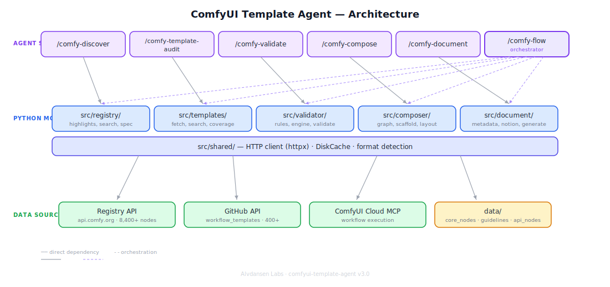

# ComfyUI Template Agent

## Research Phase Demo: Agent-Powered Template Creation

**4** production templates · **6** agent skills · **5.5M+** combined downloads

Alvdansen Labs · #proj-comfy-agent · April 2026

---

# The Problem

ComfyUI has **400+ workflow templates** and **8,400+ custom nodes** in its registry.

Creating a new template today requires:

1. **Manual discovery** — browsing the registry for uncovered node packs
2. **Compatibility research** — checking cloud support, API auth, model formats
3. **Workflow authoring** — hand-writing JSON with correct type connections
4. **Guideline compliance** — manually checking 12 submission rules
5. **Documentation** — writing index.json metadata and submission docs from scratch

Each template takes **hours of manual work** across multiple tools and references.

---

# The Solution

An **agent toolkit** that guides template creators through the entire pipeline:

```
Discover → Audit → Validate → Compose → Document
```

Six Claude Code skills, each handling one phase of template creation.

One orchestrator skill (`/comfy-flow`) chains them into a single guided session.

> "What should we build next?" → "Here's a submission-ready template" in one session.

---

# Architecture



**Three layers:**
- **Agent Skills** — 6 slash commands invoked in Claude Code
- **Python Modules** — httpx, Pydantic, DiskCache powering each skill
- **Data Sources** — Registry API, GitHub templates repo, ComfyUI Cloud MCP

---

# Skill Pipeline

| Step | Skill | What It Does |
|------|-------|-------------|
| 1 | `/comfy-discover` | Surfaces trending, new, and popular nodes from the registry |
| 2 | `/comfy-template-audit` | Searches existing templates, finds coverage gaps |
| 3 | `/comfy-validate` | Checks workflow JSON against 12 submission guidelines |
| 4 | `/comfy-compose` | Builds type-safe workflow JSON from scratch or scaffold |
| 5 | `/comfy-document` | Generates index.json, Notion markdown, thumbnail spec |

**`/comfy-flow`** orchestrates all five steps in sequence with context passed between phases.

---

# Discover & Audit

## Finding What to Build

**`/comfy-discover`** queries the registry API for:
- Trending nodes (by recent downloads)
- New nodes (recently published)
- Category filters (video, audio, image, 3D)
- Random picks for inspiration

**`/comfy-template-audit`** then checks:
- Is this node pack already covered by a template?
- What are the highest-download uncovered packs?
- Which categories have the fewest templates?

> Result: a ranked list of template opportunities with download counts.

---

# Validate & Compose

## Building the Workflow

**`/comfy-compose`** builds workflow JSON with:
- Type-safe node connections (input/output type matching)
- Scaffold mode (start from existing template, adapt)
- From-scratch mode (graph builder with layout engine)

**`/comfy-validate`** checks against 12 rules:
- Cloud compatibility (no local paths, supported models)
- API node auth requirements (7 providers detected)
- Submission guidelines (naming, structure, metadata)

> Result: a valid `workflow.json` ready for submission.

---

# Document & Submit

## Generating Submission Materials

**`/comfy-document`** produces:
- **`index.json`** — Template registry metadata (media type, models, custom nodes, IO spec)
- **`submission.md`** — Notion-formatted markdown for the submissions database
- **Thumbnail spec** — Dimensions, format requirements, suggested content

All extracted automatically from the workflow JSON.

> Result: a complete submission package — workflow, metadata, and documentation.

---

# Templates Built

| Template | Node Pack | Downloads | Status |
|----------|-----------|-----------|--------|
| MelBandRoFormer Audio Separation | comfyui-melbandroformer | 240K+ | Submitted |
| Florence2 Vision AI | comfyui-florence2 | 1.25M+ | Demo |
| GGUF Quantized txt2img | ComfyUI-GGUF | 1.69M+ | Demo |
| Impact Pack Face Detailer | comfyui-impact-pack | 2.37M+ | Demo |

**Coverage:**
- 3 media types (image, audio, vision)
- Node complexity from 5 (linear) to 11 (fan-out)
- Combined **5.5M+ downloads** across targeted node packs

---

# Metrics

| Metric | Value |
|--------|-------|
| Skills delivered | 6 |
| Templates created | 4 |
| Validation rules | 12 |
| Registry nodes indexed | 8,400+ |
| Existing templates searchable | 400+ |
| API providers with auth detection | 7 |
| Test suite | 212 tests, ~0.5s |

**Development velocity:**
- v1.0 (6 skills): 14 plans, ~1 hour total execution
- v2.0 (4 templates): built using the skills themselves

---

# What We Learned

1. **Registry API is the key enabler** — node metadata (inputs, outputs, types) makes type-safe composition possible

2. **Scaffold > from-scratch** for most templates — starting from a similar workflow and adapting is faster than building node-by-node

3. **Validation catches real issues** — GGUF model format warnings, API auth requirements, and cloud compatibility flags prevented submission errors

4. **The skill pipeline is the product** — individual skills are useful, but the guided `/comfy-flow` session is where the value compounds

---

# Next Steps

**Shipped ✓**
- Published at [alvdansen/comfyui-template-agent](https://github.com/alvdansen/comfyui-template-agent)
- GitHub Actions CI (ruff + pytest), demo GIF, full documentation
- 4 templates with submission packages ready for review

**Research Phase Integration:**
- Submit 4 templates to `workflow_templates` repo
- Deeper MCP Server v0.2.1 integration for live cloud validation
- Expand coverage: video, ControlNet, IPAdapter node packs

**Roadmap:**
- Template auto-generation from node pack metadata alone
- Community contribution pipeline via `/comfy-flow`
- Integration with Comfy-Org template review process
